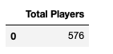
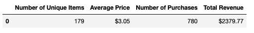
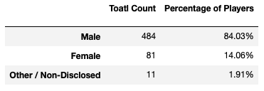
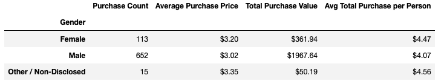
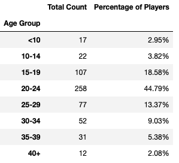
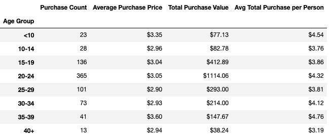
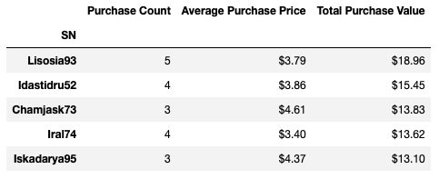
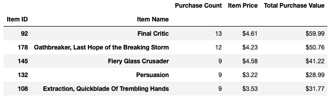
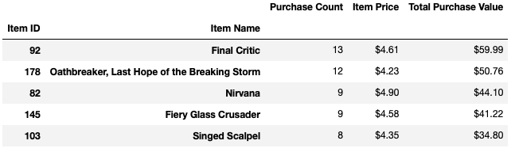

## pandas-challenge
### Background
You've been assigned the task of analyzing the data for their most recent fantasy game Heroes of Pymoli. Like many others in its genre, the game is free-to-play, but players are encouraged to purchase optional items that enhance their playing experience. As a first task, the company would like you to generate a report that breaks down the game's purchasing data into meaningful insights.
The final report includes each of the following:
#### Player Count
* Total Number of Players

#### Purchasing Analysis (Total)
* Number of Unique Items
* Average Purchase Price
* Total Number of Purchases
* Total Revenue

#### Gender Demographics
* Percentage and Count of Male Players
* Percentage and Count of Female Players
* Percentage and Count of Other / Non-Disclosed

#### Purchasing Analysis (Gender)
* The below each broken by gender
  * Purchase Count
  * Average Purchase Price
  * Total Purchase Value
  * Average Purchase Total per Person by Gender
  

#### Age Demographics
* The below each broken into bins of 4 years (i.e. &lt;10, 10-14, 15-19, etc.)
  * Purchase Count
  * Average Purchase Price
  * Total Purchase Value
  * Average Purchase Total per Person by Age Group
  

#### Top Spenders
* Identify the the top 5 spenders in the game by total purchase value, then list (in a table):
  * SN
  * Purchase Count
  * Average Purchase Price
  * Total Purchase Value
  

#### Most Popular Items
* Identify the 5 most popular items by purchase count, then list (in a table):
  * Item ID
  * Item Name
  * Purchase Count
  * Item Price
  * Total Purchase Value
  

#### Most Profitable Items
* Identify the 5 most profitable items by total purchase value, then list (in a table):
  * Item ID
  * Item Name
  * Purchase Count
  * Item Price
  * Total Purchase Value
  

### Three Conclusions:
1. The male players represented the majority and spent the most money on items.
2. Age group 20-24 had the highest purchase count and spent the most money on items.
3. The top spender's SN is Lisosia93. He/she spent $18.96 buying 5 items. The most popular and profitable item is "Final Critic" with total purchase count of 13 times and total revenue $59.99.
## Disclaimer
The resources of this master branch are only for educational purposes. All reserved rights belong to UCSD Data Science and Visualization Boot Camp.
